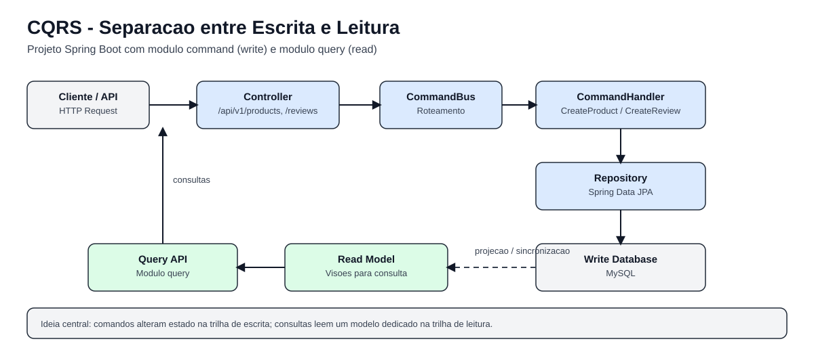

# CQRS com Spring Boot


Este repositório é um estudo prático de CQRS (Command Query Responsibility Segregation) usando Java e Spring Boot.

O projeto está dividido em dois módulos:

- `command`: responsável por escrita (create/update/delete), com persistência relacional no MySQL.
- `query`: estrutura separada para leitura, com configuração própria.

Hoje, o fluxo de escrita já está funcional e expõe endpoints para criar produtos e reviews.

## Arquitetura resumida



No módulo `command`, o fluxo segue este caminho:

`Controller -> CommandBus -> CommandHandler -> Repository -> Banco`

Em vez de centralizar regras em um service tradicional, cada caso de uso de escrita é tratado por um handler específico.
O `CommandBus` faz o roteamento do comando para o handler correto.

## Tecnologias

- Java 17
- Spring Boot 3.4.5
- Spring Web
- Spring Data JPA
- MySQL
- Maven (wrapper `mvnw`)
- Docker Compose (MySQL, Kafka, Zookeeper, Kafdrop e Mongo)

## Requisitos

- JDK 17 instalado e ativo no terminal/IDE
- Docker e Docker Compose

## Como subir o ambiente

No diretório raiz do projeto (`cqrs`):

```bash
docker compose up -d
```

No `docker-compose.yml`, o MySQL está publicado em `3307` para evitar conflito local com `3306`.

## Configuração de banco (módulo command)

Arquivo: `command/src/main/resources/application.yml`

- URL: `jdbc:mysql://localhost:3307/command`
- Usuário: `root`
- Senha: `example`
- `ddl-auto`: `create`

Com `ddl-auto: create`, o Hibernate recria as tabelas a cada inicialização do app.
Se quiser manter dados entre reinícios, troque para `update`.

## Executando a aplicação command

```bash
cd /c/Users/felip/Downloads/cqrs/cqrs
./mvnw -pl command spring-boot:run
```

Por padrão, a API sobe em `http://localhost:8080`.

## Endpoints de escrita

### Criar produto

- Método: `POST`
- URL: `/api/v1/products`

Exemplo com `curl`:

```bash
curl -X POST "http://localhost:8080/api/v1/products" \
  -H "Content-Type: application/json" \
  -d '{
    "imageUrl": "https://exemplo.com/produto.png",
    "name": "Mouse Gamer",
    "description": "Mouse RGB 16000 DPI",
    "value": 199.90
  }'
```

### Criar review

- Método: `POST`
- URL: `/api/v1/reviews`

Exemplo com `curl`:

```bash
curl -X POST "http://localhost:8080/api/v1/reviews" \
  -H "Content-Type: application/json" \
  -d '{
    "userName": "Felipe",
    "rating": 5,
    "productId": 1
  }'
```

Observação: o `productId` precisa existir na tabela `products`.

## Validando no MySQL

Entrar no banco do container:

```bash
docker exec -it cqrs-mysql-1 mysql -uroot -pexample
```

Depois, no prompt MySQL:

```sql
USE command;
SHOW TABLES;
SELECT * FROM products;
SELECT * FROM reviews;
```

## Testes

Para rodar os testes do módulo `command`:

```bash
cd /c/Users/felip/Downloads/cqrs/cqrs
./mvnw -pl command -am test
```

## Problemas comuns

### Erro de compilação com `TypeTag :: UNKNOWN` ou `ExceptionInInitializerError`

Normalmente é ambiente em Java 11 com projeto exigindo Java 17.
Confirme no terminal:

```bash
java -version
```

Se não aparecer Java 17, ajuste o `JAVA_HOME` e o SDK da IDE.

### `No database selected` no MySQL

Você conectou no servidor, mas não escolheu o schema.
Execute:

```sql
USE command;
```

### Erro de JSON no `curl`

Garanta que o JSON esteja entre aspas simples e as chaves estejam balanceadas.

## Mapa do projeto

```text
cqrs/
├── command/
│   ├── pom.xml
│   └── src/
│       └── main/
│           ├── java/com/devdeolho/
│           │   ├── CommandApplication.java
│           │   ├── bus/
│           │   │   └── CommandBus.java
│           │   ├── controller/
│           │   │   ├── ProductCommandController.java
│           │   │   └── ReviewCommandController.java
│           │   ├── domain/
│           │   │   ├── Product.java
│           │   │   ├── Review.java
│           │   │   └── command/
│           │   │       ├── Command.java
│           │   │       ├── CreateProductCommand.java
│           │   │       └── CreateReviewCommand.java
│           │   ├── handler/
│           │   │   ├── CommandHandler.java
│           │   │   ├── CreateProductCommandHandler.java
│           │   │   └── CreateReviewCommandHandler.java
│           │   └── repository/
│           │       ├── ProductRepository.java
│           │       └── ReviewRepository.java
│           └── resources/
│               └── application.yml
├── query/
│   ├── pom.xml
│   └── src/
│       └── main/
│           ├── java/com/devdeolho/
│           │   └── QueryApplication.java
│           └── resources/
│               └── application.yml
├── docker-compose.yml
├── pom.xml
├── mvnw
├── mvnw.cmd
├── README.md
└── HELP.md
```

### O que cada diretório representa

- `command/`: módulo de escrita (lado Command do CQRS).
- `query/`: módulo de leitura (lado Query do CQRS), preparado para separar consultas da escrita.
- `command/src/main/java/com/devdeolho/controller/`: entrada HTTP da escrita (`POST` de produto e review).
- `command/src/main/java/com/devdeolho/bus/`: roteamento de comando para handler.
- `command/src/main/java/com/devdeolho/domain/`: entidades de domínio persistidas no MySQL.
- `command/src/main/java/com/devdeolho/domain/command/`: objetos de comando (payload/intenção da ação).
- `command/src/main/java/com/devdeolho/handler/`: casos de uso de escrita.
- `command/src/main/java/com/devdeolho/repository/`: acesso ao banco com Spring Data JPA.
- `command/src/main/resources/` e `query/src/main/resources/`: configurações dos módulos (`application.yml`).

### O que os arquivos principais fazem

- `pom.xml` (raiz): POM pai multi-módulo, define Java 17 e dependências comuns.
- `command/pom.xml`: dependências específicas do módulo de escrita (JPA e MySQL).
- `query/pom.xml`: dependências do módulo de leitura.
- `docker-compose.yml`: infraestrutura local (MySQL, Kafka, Zookeeper, Kafdrop e MongoDB).
- `command/src/main/java/com/devdeolho/CommandApplication.java`: bootstrap Spring Boot do módulo `command`.
- `query/src/main/java/com/devdeolho/QueryApplication.java`: bootstrap Spring Boot do módulo `query`.
- `command/src/main/java/com/devdeolho/bus/CommandBus.java`: resolve qual handler executa cada command.
- `command/src/main/java/com/devdeolho/controller/ProductCommandController.java`: endpoint `POST /api/v1/products`.
- `command/src/main/java/com/devdeolho/controller/ReviewCommandController.java`: endpoint `POST /api/v1/reviews`.
- `command/src/main/java/com/devdeolho/handler/CreateProductCommandHandler.java`: cria e persiste produto.
- `command/src/main/java/com/devdeolho/handler/CreateReviewCommandHandler.java`: cria review associada a produto.
- `command/src/main/resources/application.yml`: datasource MySQL (`3307`) e configuração JPA do módulo `command`.
- `query/src/main/resources/application.yml`: configuração do módulo `query`.
